# stylee-mobile

A full-featured streetwear e-commerce mobile app built with Flutter and Firebase — the native mobile counterpart to [stylee-ecommerce](https://github.com/mazenhamada3/stylee-ecommerce).

STYLEE Mobile delivers a complete shopping experience on iOS and Android: live product catalog, cart and checkout, role-based admin panel, and real-time order management — all backed by Firebase as a fully managed backend (no custom server required).

---

## 📱 About

This is the **mobile-native evolution** of the STYLEE platform. While the web version ([stylee-ecommerce](https://github.com/mazenhamada3/stylee-ecommerce)) is a self-hosted PHP/MySQL deployment, this app is built from the ground up with Flutter and Firebase, featuring a richer feature set: live inventory per color/size variant, role-based routing guards, real-time order tracking, and a fully dynamic admin dashboard — all running on a reactive, stream-based architecture instead of traditional request/response pages.

---

## 🎥 Demo


### 1. Login & Authentication
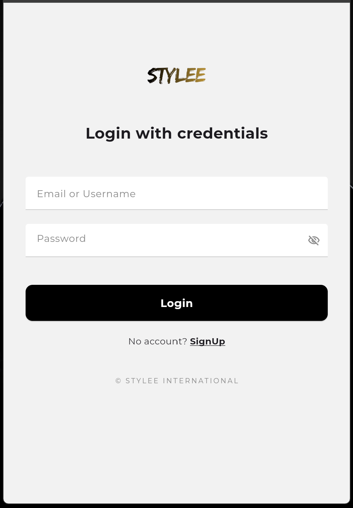
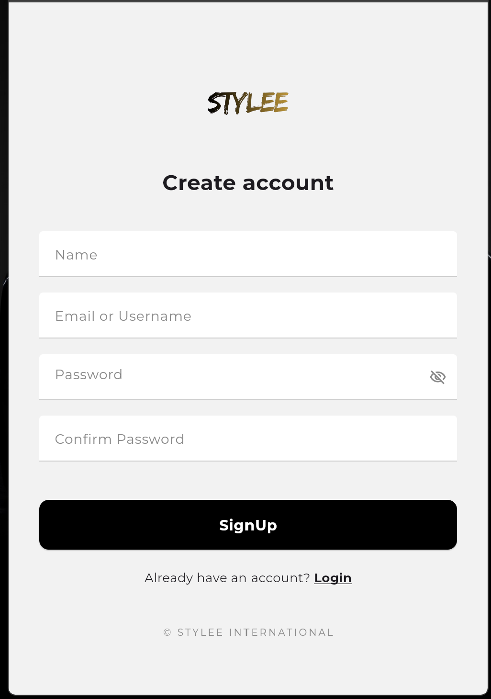

### 2. Home & Product Catalog
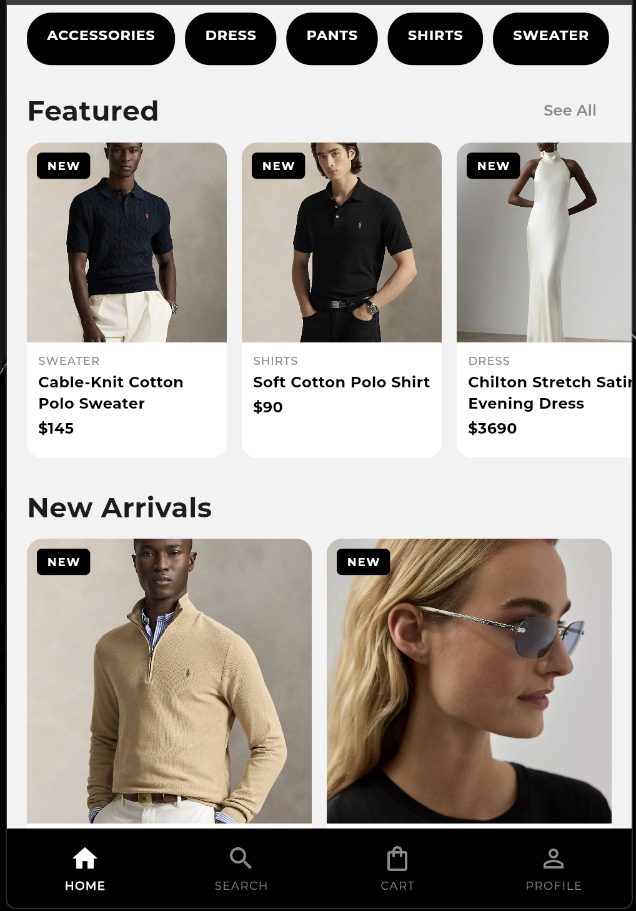
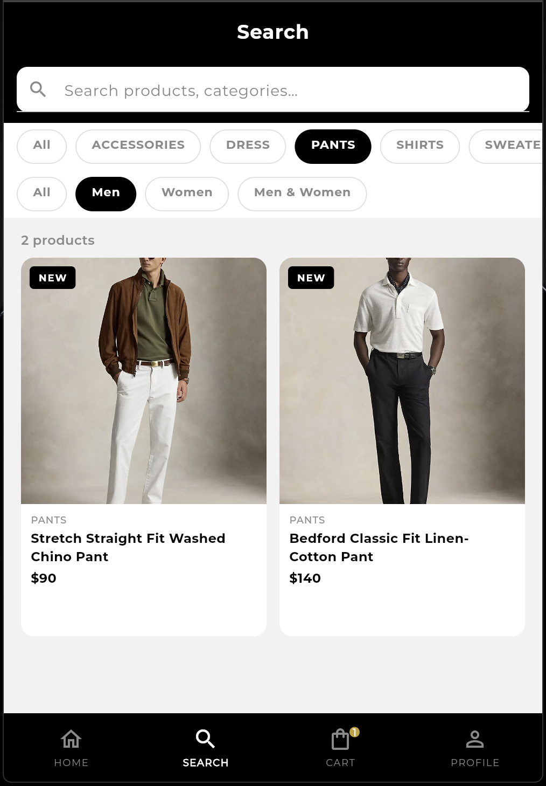

### 3. Product Detail & Variant Selection
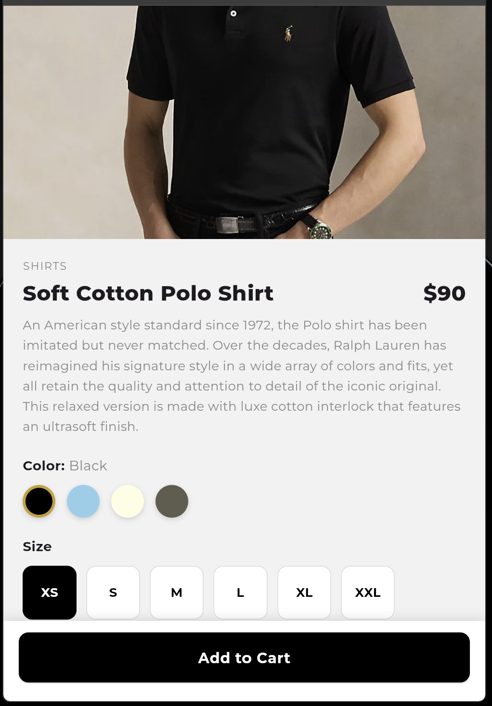
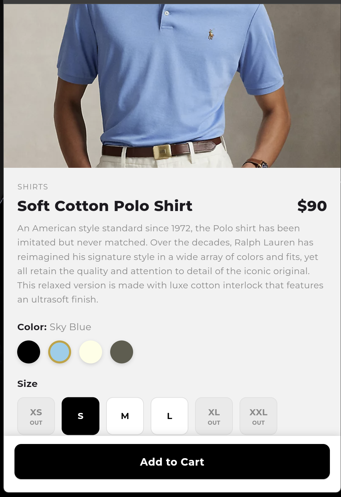

### 4. Cart & Checkout
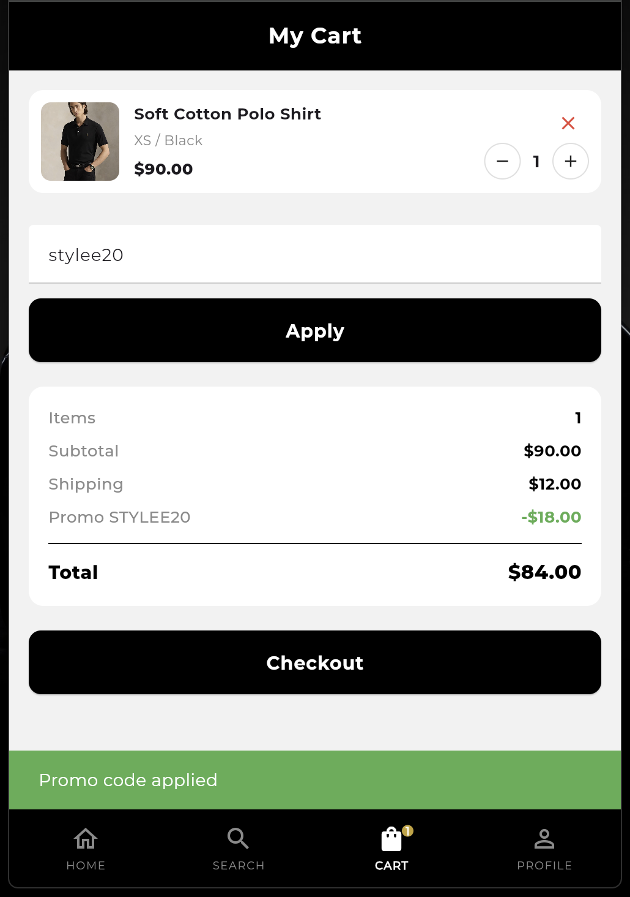
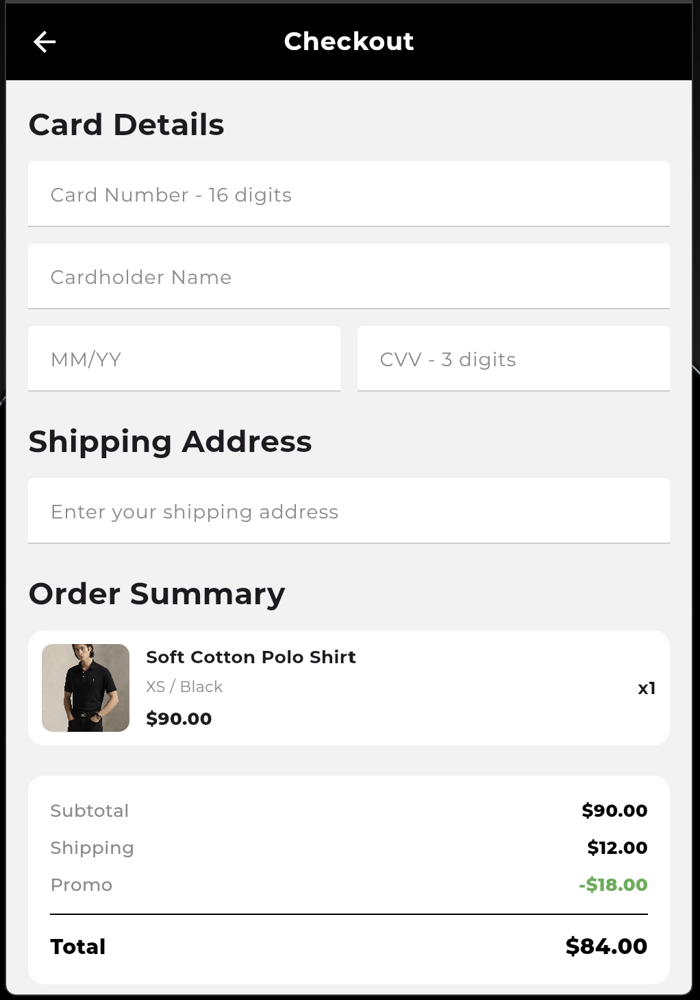

### 5. Admin Panel — Products & Orders
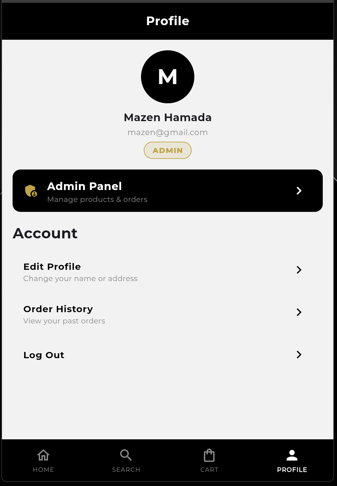
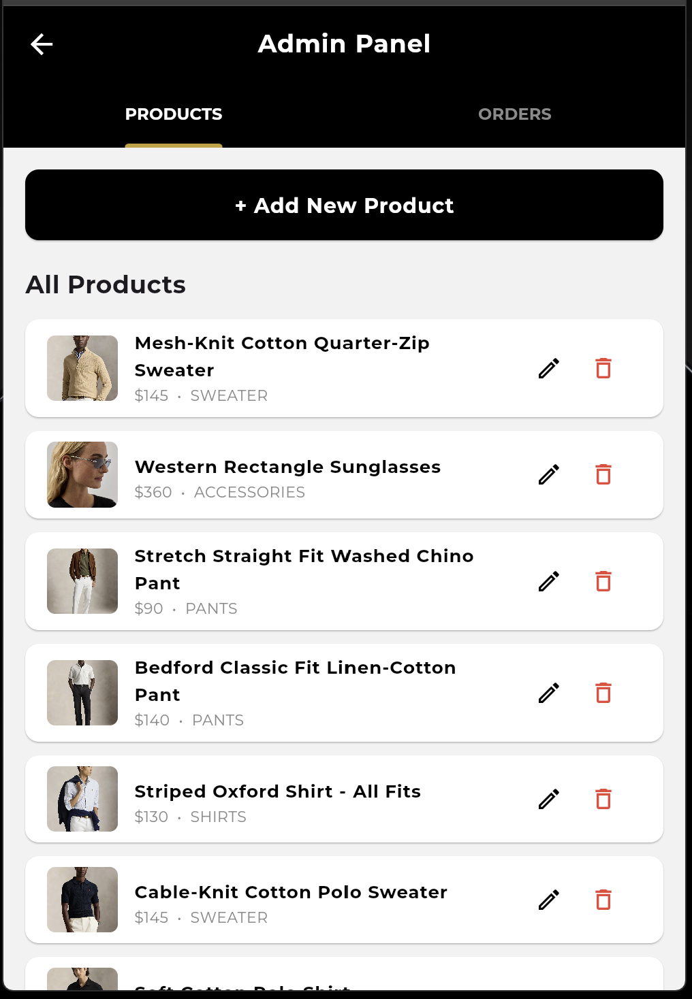
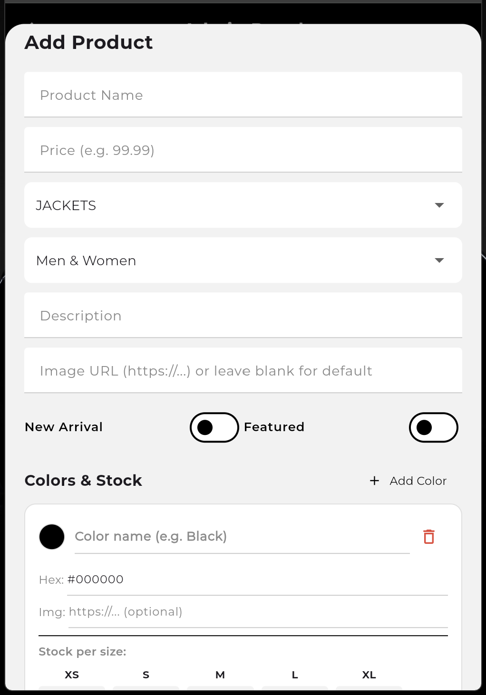
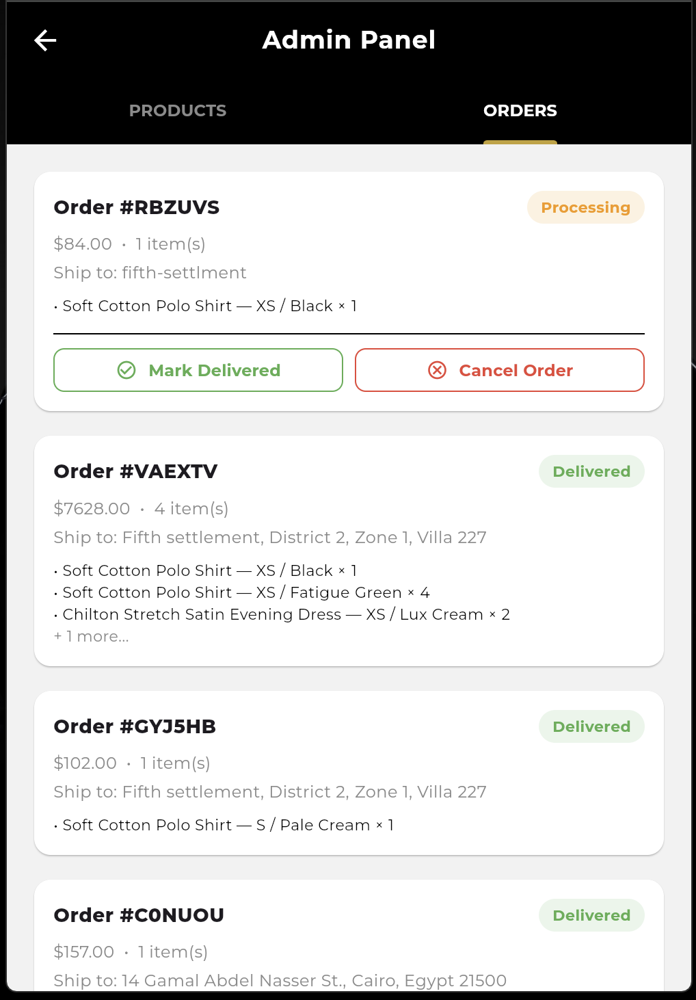

---

## ✨ Features

* **Firebase Authentication:** Secure email/password login and signup, with persistent sessions and route-level guards that redirect unauthenticated users automatically.
* **Role-Based Access Control:** Admin-only routes (`/admin`) are protected at the router level — non-admin users are silently redirected, with the Admin Panel link only ever surfaced to authorized accounts.
* **Real-Time Product Catalog:** Live-streamed product data from Cloud Firestore using `StreamBuilder` — any change in the admin panel reflects instantly across all connected clients, with no manual refresh.
* **Per-Color, Per-Size Inventory:** Each product supports multiple color variants, each with its own image, hex swatch, and independent stock count per size (XS–XXL).
* **Dynamic Admin Dashboard:** Tabbed interface for full product CRUD (add/edit/delete with a draggable bottom-sheet form) and live order management (mark delivered, cancel, view itemized order breakdowns).
* **Persistent Cart & Checkout:** Cart state managed via Provider/`ChangeNotifier`, with a full checkout flow including card validation (Luhn-style format checks, expiry regex, CVV), saved address autofill from the user's profile, and atomic order placement.
* **Deep-Linkable Routing:** URL-style navigation via `go_router`, including dynamic routes (`/product/:id`) and a shared bottom-nav shell (`ShellRoute`) that persists across Home/Search/Cart/Profile.

---

## 🛠️ Tech Stack

* **Framework:** Flutter (Dart)
* **State Management:** Provider (`ChangeNotifier`)
* **Routing:** go_router (declarative, URL-based navigation with redirect guards)
* **Backend:** Firebase (Backend-as-a-Service — no custom server)
  * **Firebase Authentication** — user login/signup/session management
  * **Cloud Firestore** — real-time NoSQL database for products, orders, and user profiles
* **Fonts/UI:** Google Fonts (Montserrat), custom theming

---

## 🗂️ Project Structure

```
stylee-mobile/
├── lib/
│   ├── models/
│   │   ├── cart_item.dart
│   │   └── product.dart
│   ├── providers/
│   │   ├── auth_provider.dart
│   │   └── cart_provider.dart
│   ├── screens/
│   │   ├── admin/
│   │   │   └── admin_screen.dart
│   │   ├── auth/
│   │   │   ├── login_screen.dart
│   │   │   └── signup_screen.dart
│   │   ├── cart/
│   │   │   └── cart_screen.dart
│   │   ├── checkout/
│   │   │   └── checkout_screen.dart
│   │   ├── home/
│   │   │   └── home_screen.dart
│   │   ├── product/
│   │   │   └── product_detail_screen.dart
│   │   ├── profile/
│   │   │   └── profile_screen.dart
│   │   ├── search/
│   │   │   └── search_screen.dart
│   │   └── main_shell.dart
│   ├── services/
│   │   ├── auth_service.dart
│   │   └── firestore_service.dart
│   ├── theme/
│   │   └── app_theme.dart
│   ├── widgets/
│   │   ├── product_card.dart
│   │   └── shared_widgets.dart
│   ├── app_router.dart
│   ├── firebase_options.dart
│   └── main.dart
├── Docs/
│   └── STYLEE_Mobile_SRS.pdf
├── Demo/
│   └── (all presentation screenshots)
├── pubspec.yaml
└── README.md
```

---

## 📄 Documentation

A full Software Requirements Specification (SRS) was produced for this project, covering functional/non-functional requirements, ER diagrams, DFDs, sequence diagrams, and use case diagrams:

📎 [STYLEE Mobile — SRS Document](project/Docs/Software_Requirements_Specification_(SRS).pdf)

---

## 🚀 Setup & Local Development

1. **Clone the repository:**
```bash
git clone https://github.com/mazenhamada3/stylee-mobile.git
cd stylee-mobile
```

2. **Install dependencies:**
```bash
flutter pub get
```

3. **Configure Firebase:**
   * Create a Firebase project at [console.firebase.google.com](https://console.firebase.google.com).
   * Enable **Authentication** (Email/Password) and **Cloud Firestore**.
   * Run `flutterfire configure` to generate your own `firebase_options.dart`, or manually add your platform config files (`google-services.json` for Android, `GoogleService-Info.plist` for iOS).

4. **Run the app:**
```bash
flutter run
```

---

## 👤 Team Contributions

This was a 3-member team project. My specific focus areas:

| Module | Files | What I Built |
| :--- | :--- | :--- |
| **App Routing & Navigation Guards** | `lib/app_router.dart` | Designed the full `go_router` configuration, including auth/admin redirect logic, the dynamic `/product/:id` route with async product resolution, and the shared bottom-nav `ShellRoute`. |
| **App Entry & Global Providers** | `lib/main.dart` | Set up Firebase initialization, `MultiProvider` wiring for global auth/cart state, and the root `MaterialApp.router` configuration. |
| **Authentication Screen** | `lib/screens/auth/login_screen.dart` | Built the login UI and Firebase Authentication integration, including validation, error handling, and loading states. |
| **Admin Dashboard** | `lib/screens/admin/admin_screen.dart` | Built the full tabbed admin panel: live product CRUD with a draggable add/edit form (per-color, per-size stock management), and live order management (status updates, cancellation). |
| **Checkout Flow** | `lib/screens/checkout/checkout_screen.dart` | Built the complete checkout screen — card/address validation, saved address autofill, order placement, and cart clearing on success. |

*(Note: Models, additional providers, core screens like Home/Search/Cart/Profile, and Firestore service logic were handled by my teammates.)*

---

## ⚠️ Disclaimer

This is an academic team project built for a Mobile Application Development course. Firebase Authentication and Firestore security rules are configured for development/demo purposes — for production use, rules should be further hardened and sensitive operations should be moved server-side via Cloud Functions.
